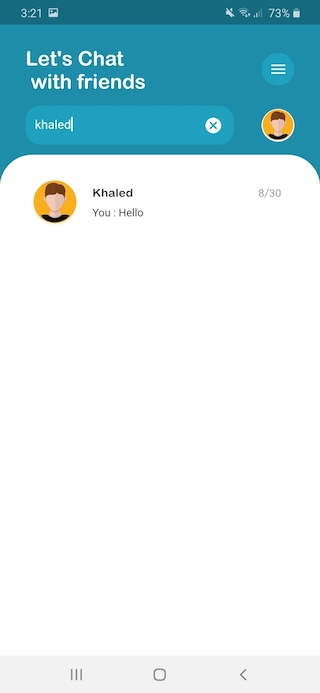
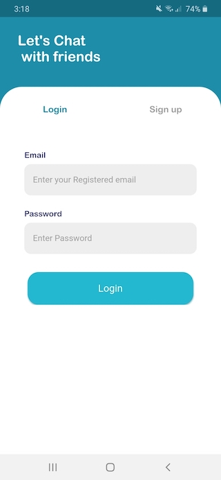
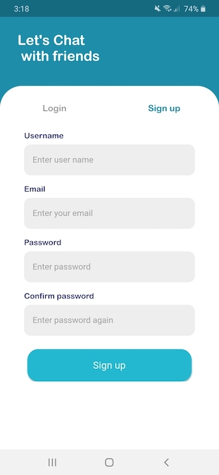

# Chat Application

A new open source Flutter project as a base for chat appilcation.

    
     
      
      
      
      
  
  

## Features : 

- Sign in - SignUp - logout .
- linking with Firebase Authentication system.
- client and backend validation during logging and register.
- search by name of users.
- real-time send and receive messages using stream and linking with Firebaes Firestore database.
- viewing profile page and able to edit info and upload images.
- use pagination for showing the messages and also for friends list.
- nice looking UI and user-friendly animation with a splash screen at the beginning.
- using [Bloc](https://bloclibrary.dev/) for state management.
- using [Get-it](https://pub.dev/packages/get_it) as a Service Locator for dependency injection.

This project is a starting point for a Flutter application.
